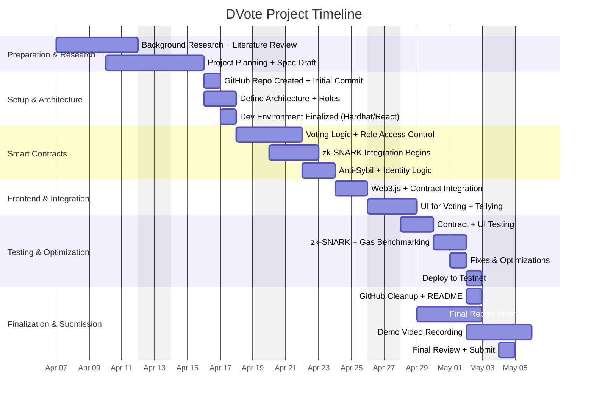

# DVote 
## A Web3-Based Voting Framework with zk-SNARK Privacy on Ethereum
DVote is a secure, transparent, and privacy-preserving blockchain-based voting application. By integrating zero-knowledge proofs (zk-SNARKs), Ethereum smart contracts, and a React.js frontend, the system allows voters to cast anonymous votes while maintaining full on-chain auditability and real-time result updates. The platform features role-based access control, seamless wallet integration (MetaMask), and protection against double voting through cryptographic nullifiers.

## Prerequisites
Before running the DVote app, ensure you have the following installed:

| Tool               | Version (Recommended) | Install Guide                                                   |
|--------------------|-----------------------|-----------------------------------------------------------------|
| Node.js & npm      | v16+                  | [Node.js](https://nodejs.org)                                   |
| Hardhat            | Latest                | `npm install --save-dev hardhat`                                |
| MetaMask Extension | Latest                | [MetaMask](https://metamask.io/download)                        |
| Git                | Latest                | [Git](https://git-scm.com/downloads)                            |


##  **Project Flow Overview**

This quick guide outlines how the DVote system works from start to finish:

### **Admin Tasks:**

- Deploys the smart contract to the Ethereum network.
- Adds election candidates and registers eligible voters.
- Starts the election, making it available to the public.

### **Voter Tasks:**

- 🦊 Connects their MetaMask wallet to the DVote frontend.
- 🔐 Generates a zero-knowledge proof (zk-proof) to verify eligibility anonymously.
- 🗳️ Selects a candidate and casts their vote securely and privately.

### **System Operations:**

- Verifies the zk-proof on-chain to ensure eligibility and prevent double voting.
- 📈Updates the vote count and participation stats in real-time as new votes are mined.

## Running as Admin (Local Setup)

Follow these steps to run the DVote app and access admin features locally:

### 1. Start the Local Ethereum Node
From the root directory of the project:
```bash
npx hardhat node
```

This launches a local Ethereum blockchain (using Hardhat Network) and displays a list of accounts along with their private keys in your terminal. These accounts will be used for contract deployment, admin access, and testing.

### 2. Deploy the Contract to Localhost
In a new terminal window (keep the node running), deploy the voting contract:
```bash
npx hardhat run scripts/deploy.js --network localhost
```

This deploys the contract using the first account listed in the node output (Account #0),which acts as the Admin.

### 3. Import Admin Account into MetaMask
- Copy the **private key** of Account #0 from the terminal output.
- In MetaMask, go to *Import Account* and paste the private key.
- Switch the MetaMask network to **Localhost 8545**.
  
This lets you control the election as the Admin from the DVote interface.
### 4. Start the Frontend
From the frontend/ directory, install dependencies and start the React app:
```bash
npm install
npm start
```
Then open your browser and navigate to:
```bash
http://localhost:3000
```
 Once after you navigate connect MetaMask using the admin account. You should now have access to all admin features including starting and managing elections.

## Running on Sepolia Testnet (Recommended)

This section explains how to deploy and run DVote on the Ethereum Sepolia Testnet for a real-world simulation. Sepolia allows public blockchain testing **without using real ETH**.

### **Prerequisites:**

| Tool/Service          | Purpose                                                     | Link                                        |
|-----------------------|-------------------------------------------------------------|--------------------------------------------|
| **Alchemy account**   | Blockchain RPC provider for Sepolia (or use Infura/Moralis) | https://dashboard.alchemy.com              |
| **MetaMask wallet**   | Browser wallet to interact with Ethereum                    | https://metamask.io                        |
| **Sepolia faucet**    | Free ETH for testing transactions                           | https://sepoliafaucet.com                   |
| **Node.js & npm**     | For running the frontend and Hardhat                        | https://nodejs.org                          |

---

###  **1. Configure `.env`**

1️⃣ In the root of your project, **create a `.env` file** to store your sensitive keys securely.

Example `.env` file:

```dotenv
API_URL=https://eth-sepolia.g.alchemy.com/v2/YOUR_ALCHEMY_KEY
PRIVATE_KEY=your_metamask_private_key
```

**API_URL:** Get this from Alchemy (or Infura) after creating a Sepolia project.
**PRIVATE_KEY:** Export your MetaMask private key **(do NOT share this publicly!)**. This is the account that will deploy the contract and act as the Admin.
**Important:** Make sure your MetaMask is set to the **Sepolia network** and has test ETH (from the faucet).

### 2. Deploy the Contract to Sepolia
In your terminal (from the project root):
```bash
npx hardhat run scripts/deploy.js --network sepolia
```
This will:

- Compile the contract.
- Deploy it to Sepolia using the account in your `.env.`
- Output the contract address (copy this for the next step).

### 3. Connect the Frontend
Navigate to the frontend folder:
```bash
cd frontend/
```

Update the contract address:
Open `frontend/src/contract/contract-address.json.`
Replace the existing address with the Sepolia contract address you got from the deployment step.
Example
```bash
{
  "Voting": "0xYourSepoliaContractAddressHere"
}
```

Install dependencies and start the app:
```bash
npm install
npm start
```
Open the app at:
```bash
http://localhost:3000
```


## DVote Project Timeline

This Gantt chart outlines the full project development plan for **DVote: A Web3-Based Voting Framework with zk-SNARK Privacy on Ethereum**, based on project requirements, rubric criteria, and instructor feedback.


---

## Weekly Breakdown

### Week 1 (April 13 - April 19)

**Goals:Preparation & Architecture Setup**
- Background Research & Literature Review  
- Project Planning + Specification Draft  
- GitHub Repository Setup + Initial Commit  
- Define Project Architecture & User Roles  
- Finalize Development Environment (Hardhat + React)  

**Outcome:**
- Solid project structure, GitHub initialized  
- Team roles and tech stack locked  
- Ready to begin smart contract development  

---

### Week 2 (April 20 - April 26)

**Goals:Smart Contract Core + Frontend Start**
- Implement Voting Logic + Role-Based Access Control  
- Begin zk-SNARK Integration  
- Develop Anti-Sybil and Identity Verification Logic  
- Start Web3.js + Smart Contract Integration  
- Basic UI Design for Voting and Result Tallying  

**Outcome:**
- Core smart contract logic in place  
- zk-SNARK structure started  
- Functional frontend-to-contract connection  
- UI scaffolding implemented  

---

### Week 3 (April 27 - May 4)

**Goals:Testing, Finalization, and Submission**
- Contract + UI Testing  
- zk-SNARK and Gas Benchmarking  
- Final Fixes and Optimizations  
- Deploy to Ethereum Testnet  
- GitHub Cleanup + Documentation  
- Final Report & Demo Video  

**Outcome:**
- Fully functional DApp tested and deployed  
- Repo cleaned and documented  
- Final deliverables ready for submission  
