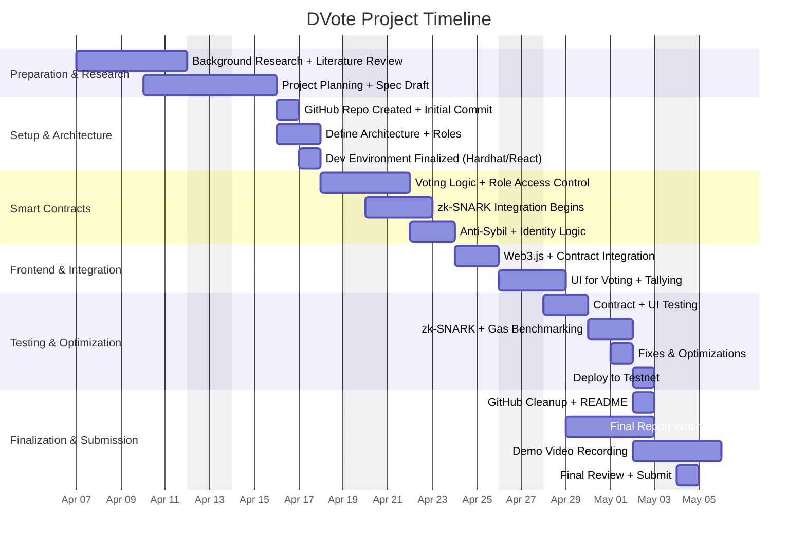

# DVote

## A Web3-Based Voting Framework with zk-SNARK Privacy on Ethereum

**DVote** is a secure, transparent, and privacy-preserving blockchain voting system built on Ethereum. It combines **zk-SNARKs**, **smart contracts**, and a **React.js** frontend to allow eligible voters to cast **anonymous** and **verifiable** votes. It features real-time results, on-chain auditability, and robust protections against double voting and Sybil attacks.

---

## 📽️ [Watch the Demo Video](https://youtu.be/CCs1yzcKARE)

> In the demo, we walk through:

* Connecting to MetaMask
* Creating and managing an election as admin
* Adding candidates and registering voters
* Casting a vote anonymously as a voter
* Verifying vote restrictions (like preventing double voting)
* Viewing real-time results and adjusting frontend settings (dark mode, notifications)

---

## ✨ Features

* ✅ **zk-SNARK Privacy**: Zero-knowledge voting to protect voter identity.
* 🔐 **Role-Based Access Control**: Admins and voters have different permissions.
* 🗳️ **On-Chain Elections**: Every election and vote is recorded transparently.
* 🛡️ **Sybil Attack Prevention**: Voters must be explicitly registered.
* 💻 **Live Results**: Real-time participation updates.
* 🎨 **User Customization**: Light/dark mode, MetaMask alerts, settings menu.

---

## 🛠 Prerequisites

| Tool               | Version (Recommended) | Install Guide                            |
| ------------------ | --------------------- | ---------------------------------------- |
| Node.js & npm      | v16+                  | [Node.js](https://nodejs.org)            |
| Hardhat            | Latest                | `npm install --save-dev hardhat`         |
| MetaMask Extension | Latest                | [MetaMask](https://metamask.io/download) |
| Git                | Latest                | [Git](https://git-scm.com/downloads)     |

---

## 🚀 Quick Start (Localhost)

### 1. Start Local Ethereum Node

```bash
npx hardhat node
```

### 2. Deploy Contract Locally

```bash
npx hardhat run scripts/deploy.js --network localhost
```

### 3. Import Admin Account into MetaMask

Use the private key from the terminal output after `hardhat node`.

### 4. Run Frontend

```bash
cd frontend
npm install
npm start
```

Go to `http://localhost:3000`

---

## Deploying to Sepolia Testnet

### 1. Configure `.env`

Create a `.env` file in the root directory:

```dotenv
API_URL=https://eth-sepolia.g.alchemy.com/v2/YOUR_ALCHEMY_KEY
PRIVATE_KEY=your_metamask_private_key
```

### 2. Deploy to Sepolia

```bash
npx hardhat run scripts/deploy.js --network sepolia
```

### 3. Update Frontend Contract Address

Edit `frontend/src/contract/contract-address.json`:

```json
{
  "Voting": "0xYourSepoliaContractAddressHere"
}
```

### 4. Run Frontend

```bash
cd frontend
npm install
npm start
```

---

## 📂 Repository Structure

```
DVote/
├── contracts/
│   └── Voting.sol                    # Solidity smart contract for voting logic
│
├── scripts/
│   └── deploy.js                     # Hardhat deployment script
│
├── frontend/
│   ├── public/
│   │   └── index.html                # Main HTML template
│   │
│   ├── src/
│   │   ├── contract/
│   │   │   ├── artifacts/
│   │   │   │   └── Voting.json       # Compiled contract ABI (optional in repo)
│   │   │   ├── contract-address.json # Deployed contract address reference
│   │   │   └── votingContract.js     # JS wrapper to interact with contract
│   │   │
│   │   ├── AdminPanel.js             # Admin interface for managing elections
│   │   ├── DVoteApp.js               # Root component for app logic
│   │   ├── Results.js                # Component to show live results
│   │   ├── TabComponents.js          # Navigation tab logic
│   │   ├── App.js                    # Main app container
│   │   ├── index.js                  # Entry point
│   │   └── setupTests.js             # React test config
│   │
│   ├── DVoteApp.css
│   ├── AdminPanel.css
│   ├── Results.css
│   ├── App.css
│   ├── index.css
│   └── package.json                  # Frontend dependencies
│
├── .env.example                      # Environment variable sample
├── hardhat.config.js                # Hardhat setup and network config
├── package.json                     # Root package file for Hardhat tools
└── README.md                        # Project documentation
```

---

## ✅ GitHub Activity Checklist

| Criteria                           | Status            |
| ---------------------------------- | ----------------- |
| Frequent Commits                   | ✅ Yes             |
| Descriptive Commit Messages        | ✅ Yes             |
| Progressive Development (3+ Weeks) | ✅ Confirmed       |
| Organized Repo Structure           | ✅ Structured      |
| Instructions to Build & Run        | ✅ Included        |
| Public Repository                  | ✅ Yes             |
| Demo Video Available               | ✅ Yes (see above) |

---

## 📊 DVote Project Timeline



---

## 📅 Weekly Breakdown

### Week 1 (April 13 – April 19): *Preparation & Architecture*

* ✅ Background research
* ✅ Project planning and GitHub setup
* ✅ Environment (Hardhat + React) finalized

### Week 2 (April 20 – April 26): *Smart Contracts + Frontend Start*

* ✅ Voting logic, role control, zk-SNARK setup
* ✅ Identity protection and anti-Sybil logic
* ✅ UI & Web3 integration

### Week 3 (April 27 – May 4): *Testing + Finalization*

* ✅ zk-SNARK testing and gas benchmarking
* ✅ UI testing and final deployment
* ✅ README polish, report writing, and demo recording
